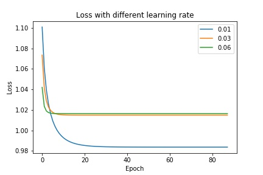
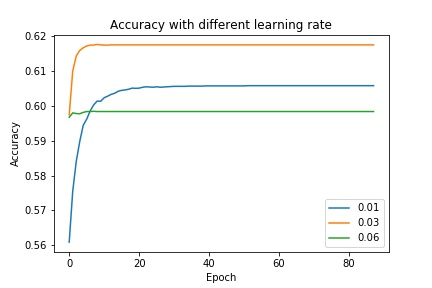

# Task1: 影评情感分类

2017-08-14

- 实现基于logistic/softmax regression的文本分类
- 数据集：[Classify the sentiment of sentences from the Rotten Tomatoes dataset](https://www.kaggle.com/c/sentiment-analysis-on-movie-reviews)

## 1. 任务描述

1. 将影评按照情感分成五类
  - 0： negative
  - 1： somewhat negative
  - 2： neutral
  - 3： somewhat positive
  - 4： positive

2. 使用logistic/softmax回归
  - 多类别使用softmax分类
  - 类别使用one-hot向量表示

3. 分析不同的特征、损失函数、学习率对最终分类性能的影响
  - 特征 Feature
    1. Bag-of-Word(BoW)
    2. bigrams
    3. trigrams
    4. word2vec
  - 损失函数 Loss function
    - softmax使用交叉熵作为损失函数
    - 使用不同的正则化因子reg
  - 学习速率 Learning rate
    - 梯度下降时每一步更新的步长step

4. （随机）梯度下降
  - 每次以batch为一个单位
  - 每一个epoch进行随机打乱

## 2. 实验模型  

### 2.1 特征提取

- BoW
  1. 从训练样本中提取一个词表Voc，大小为VocSize
  2. 将每个词语表示成一个长度为VocSize的词向量，其中只有该词语对应的位置为1，其余位置为0
  3. 将一个句子中的词向量相加

- bigrams/trigrams
  1. 从训练样本中抽取一个由bigrams/trigrams组成的词表
  2. 按照词向量的方式提取特征

- word2vec
  1. 利用gensim的Word2Vec模型，获得训练集上的连续的word embedding模型
  2. 将每个词语根据模型获得其wording embedding
  3. 将一个句子中的wording embedding相加

### 2.2 softmax回归

- softmax是logistics在多类别分类的推广

  $$ softmax(x) = \frac{exp(x)}{\sum_{i=0}^{i=k}exp(x_i)} ​$$

- 扩展的softmax在分母上进行了加1平滑

  $$ softmax(x) = \frac{exp(x)}{1 + \sum_{i=0}^{i=k}exp(x_i)} $$

- 一般使用交叉熵作为Loss function

$$ J(\theta)=- \frac{1}{m}\sum_{i=0}^{i=k}y*log(\hat y) + \frac{1}{2}*\lambda *\theta^2 $$

### 2.3 梯度下降

- 使用随机梯度下降，每次选取大小为batch_size=120进行梯度更新
- 每一轮(epoch)结束，重新打乱训练集，再进行新的一轮计算
- 梯度更新公式为
  $$ \nabla_\theta J(\theta) = X^T .* (\hat y - y)  + \lambda * \theta $$

  $$  \theta = \theta + \alpha * \nabla_\theta J(\theta) $$

  $$ X \in R^{m*n}, \hat y, y \in R^{n*k}, \theta \in R^{n*k} $$

## 3. 实验结果

### 3.1 不同特征对于分类性能的影响

在相同的学习速率(0.01)和正则化因子(0.00)下，BoW, bigrams, trigrams和word2vec分类性能如下表所示：

| Performance/Feature | BoW       | bigrams | trigrams | word2vec |
| ------------------- | --------- | ------- | -------- | -------- |
| Loss                | **0.923** | 1.037   | 1.073    | 1.524    |
| Accuracy            | **0.642** | 0.608   | 0.606    | 0.431    |
| average precision   | **0.585** | 0.549   | 0.567    | 0.345    |
| average recall      | **0.255** | 0.234   | 0.233    | 0.159    |
| average F           | **0.303** | 0.267   | 0.257    | 0.193    |

### 3.2 不同学习速率和正则化因子对于Loss和Accuracy的影响

BoW特征在不同学习速率和正则化因子的分类性能

Loss with different reg and learning rate

| Reg/Learning | 0.01      | 0.03  | 0.06  |
| ------------ | --------- | ----- | ----- |
| 0.00         | **0.923** | 0.949 | 0.980 |
| 0.01         | 0.984     | 1.015 | 1.016 |
| 0.03         | 1.057     | 1.067 | 1.129 |

Accuracy with different reg and learning rate

| Reg/Learning | 0.01      | 0.03  | 0.06  |
| ------------ | --------- | ----- | ----- |
| 0.00         | **0.642** | 0.637 | 0.634 |
| 0.01         | 0.606     | 0.618 | 0.599 |
| 0.03         | 0.577     | 0.599 | 0.553 |

### 3.3 不同学习速率对于收敛速度的影响

### 3.4 不同类别之间的对比
在准确率最高的BoW特征，学习速率(0.01)和正则化因子(0.00)下，5个类别的precision、recall和F如下表所示

| Class | Precision | Recall    | F         |
| ----- | --------- | --------- | --------- |
| 0     | 0.534     | 0.043     | 0.080     |
| 1     | 0.548     | 0.165     | 0.254     |
| 2     | **0.685** | **0.739** | **0.711** |
| 3     | 0.572     | 0.265     | 0.362     |
| 4     | 0.577     | 0.060     | 0.108     |

